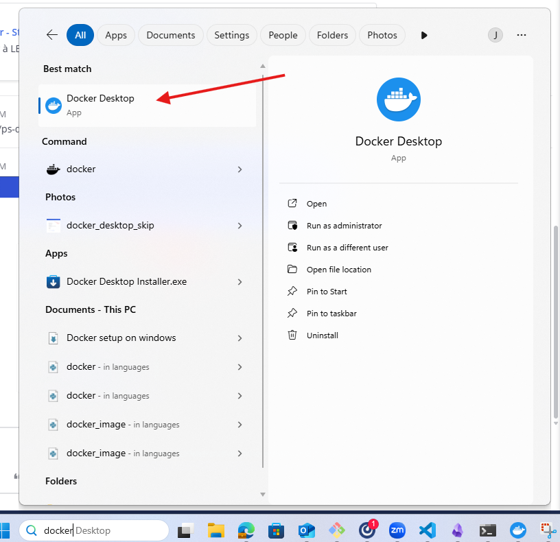
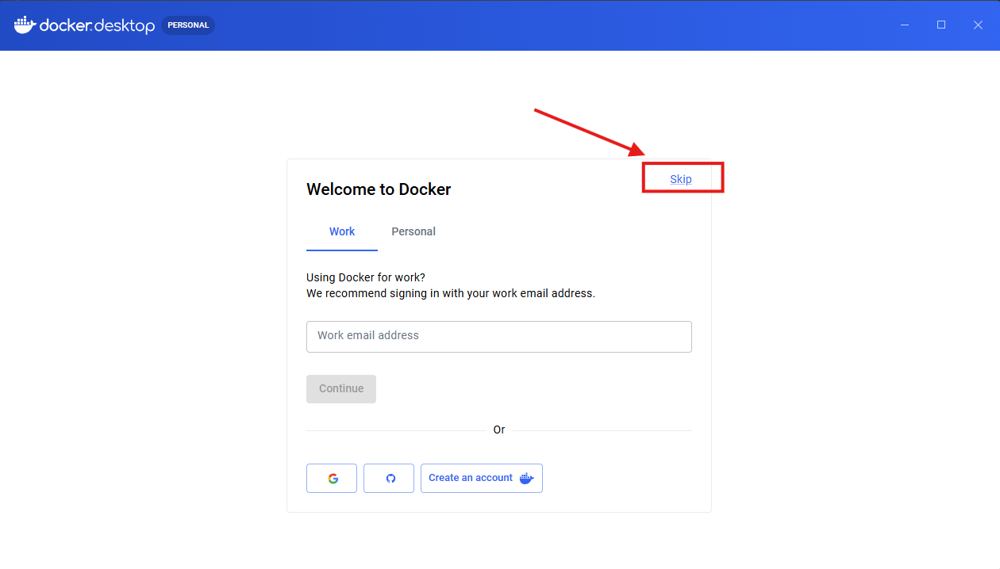
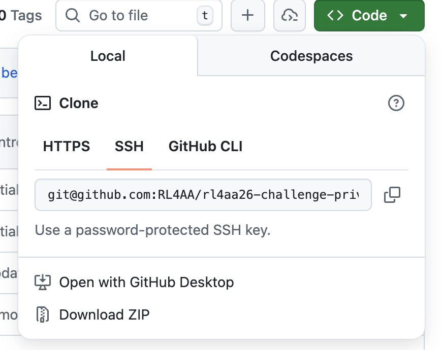
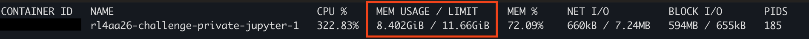
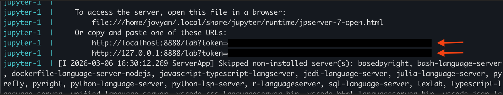
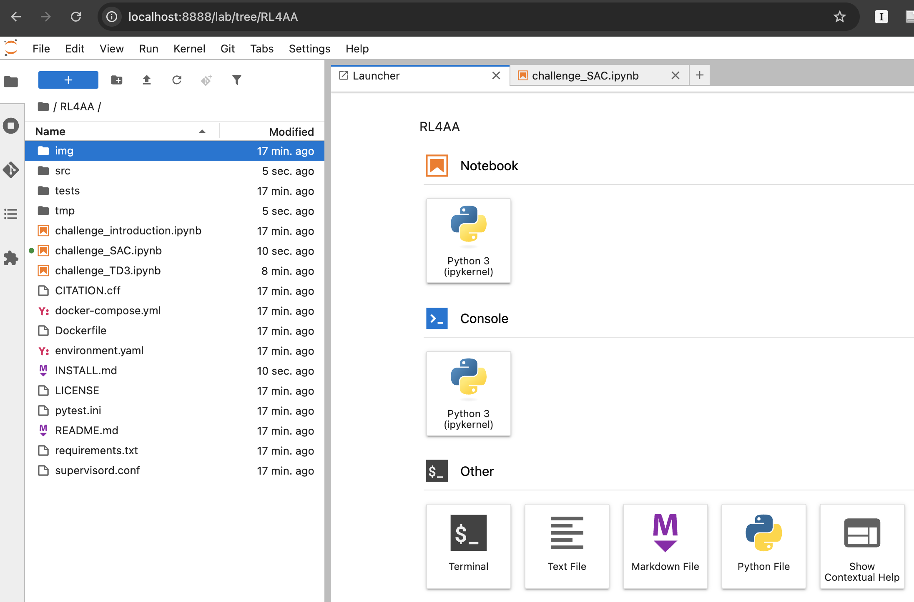
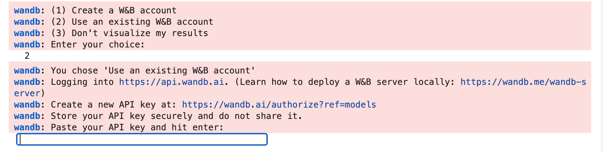

# To do before the workshop 📋

You will need 6GB of free space in your laptop to run this challenge.

## Create an account in Weights and Biases
We will use Weights and Biases as leaderboard. You will be able to see your runs and final score with respect to the other participants.

- Create an **account** in Weights & Biases (wandb): [https://wandb.ai/](https://wandb.ai/)
- Create a new **API key** following these instructions: [https://docs.wandb.ai/models/quickstart](https://docs.wandb.ai/models/quickstart)

🚨You will need the API key to login into wandb inside the challenge notebooks🚨.

🚨The API key is only generated once🚨, so save it somewhere accessible. You can, for example, add it to your `.bash_profile` with:

```bash
export WANDB_API_KEY=your_key_here
```

If you lose your key you can always generate a new one from [https://wandb.ai/authorize](https://www.wandb.ai/authorize).

## Install Docker 🐳
We will run the challenge in Docker so that you don't have to install anything locally.

### Linux:

In your terminal, install docker via:
```
sudo apt install docker.io docker-compose-v2
```

Verify your installation:
```bash
docker --version
docker compose version
```

### macOS

In your terminal, install docker and colima via `brew`:
```
brew install docker colima
```

The virtual machine created by Colima allocates by default 2 CPUs and 2GB of RAM.
The training you will run will consume more, so we suggest to allocate 9GB of RAM to make sure your training does not crash. You can modify this every time you start colima.

Verify your installation:
```bash
colima start --cpu 4 --memory 9
docker --version
docker compose version
colima stop
```


> **Note**: On macOS, `colima start` must be run before Docker commands will work — it provides the container engine that Docker Desktop would otherwise supply.

### Windows

Docker on Windows requires WSL2 (Windows Subsystem for Linux). Check if you already have it installed by opening PowerShell and running:
```powershell
wsl --version
```
If this prints version information, you're good — skip to the options below. If you get an error, install WSL2:
```powershell
wsl --install
```
Restart your computer when prompted. More info on WSL2 [here](https://learn.microsoft.com/en-us/windows/wsl/install).

Then choose one of the two options below:

**Option A — Docker Desktop via `winget` (fastest):**

`winget` comes preinstalled on Windows 10 (1709+) and Windows 11. Open PowerShell as Administrator and run:
```powershell
winget install Docker.DockerDesktop
```

**Option B — Docker Desktop (download installer):**

1. Download and install Docker Desktop from [https://www.docker.com/products/docker-desktop/](https://www.docker.com/products/docker-desktop/)
2. During installation, ensure **"Use WSL 2 instead of Hyper-V"** is selected.

**Verify your installation** (both options):
```powershell
docker --version
docker compose version
```

**Start the Docker Desktop app**

Docker Desktop must be running for Docker commands to work. It may start automatically after installation — look for the whale icon in your system tray. If it didn't start, launch it from the Start menu:



You **do not** need to create a Docker account — you can skip any sign-in prompts:



Now docker is setup and ready for the challenge!🎉

## Download the challenge code to your laptop 💻
The challenge code can be found in GitHub: [https://github.com/RL4AA/rl4aa26-challenge](https://github.com/RL4AA/rl4aa26-challenge)

If you have git installed you can clone the repository by typing:
```bash
git clone https://github.com/RL4AA/rl4aa26-challenge.git
```

Otherwise just download it as a zip file by clicking the green button `Code` and then `Download ZIP`:



## Test that everything runs

Go into the repository folder, wherever you saved it, and start Docker:

### Linux
```bash
cd rl4aa26-challenge
sudo systemctl start docker
docker compose up
```
When you are ready to stop, press `Ctrl+C` and then stop the Docker daemon with:
```bash
sudo systemctl stop docker
```

### macOS

```bash
cd rl4aa26-challenge
colima start
docker compose up
```
When you are ready to stop, press `Ctrl+C` and then:
```bash
colima stop
```

### Windows
Open Docker Desktop, then open a terminal (PowerShell or Command Prompt):
```powershell
cd rl4aa26-challenge
docker compose up
```

### Container RAM monitoring
We recommend that you monitor your RAM usage in real time by typing this in your terminal:

```bash
docker stats
```


### Accessing the notebook

Once Docker has grabbed the repository's files and installed the required packages (might take some moments) you should see some local addresses in your terminal, as shown below:



Paste one of those addresses in your web browser and you should get access to a Jupyter Lab instance looking like:



Choose one of the challenge notebooks, either `challenge_SAC.ipynb` or `challenge_TD3.ipynb`, and run the first cell with the library imports to make sure everything runs.

### Logging into Weights & Biases

During the challenge, when you execute the training cell, you will be prompted about your `wandb` account and API key:



Alternatively, you can log in beforehand by running this in a notebook cell or terminal:
```bash
wandb login
```

## Alternative installation for experienced practitioners 👩🏾‍💻
If you regularly code in Python and are used to virtual environments, feel free to run everything locally. **You need Python 3.11 or higher.** Please be ready to debug your local installation.

### With `venv`

```bash
cd rl4aa26-challenge
python3 -m venv .venv
source .venv/bin/activate
pip install -r requirements.txt
```

To deactivate just use `deactivate`.

**Windows users** — the activate command depends on your terminal:

| Terminal | Command |
|----------|---------|
| PowerShell | `.venv\Scripts\Activate.ps1` |
| Command Prompt (cmd) | `.venv\Scripts\activate.bat` |
| Git Bash | `source .venv/bin/activate` |

### With `miniconda`, `miniforge`
Make sure you have [miniforge](https://conda-forge.org/download/) or [miniconda](https://www.anaconda.com/docs/getting-started/miniconda/main) installed. Then run:

```bash
cd rl4aa26-challenge
conda env create -f environment.yaml
conda activate rl4aa26-challenge
```

To deactivate just use `conda deactivate`.
